# Design Document — Moorcado Marketplace

## Overview

Moorcado es un marketplace digital para compra y venta de ganado vacuno en Honduras y Centroamérica. Corre íntegramente en el navegador: no existe backend real, ni API REST, ni base de datos remota. Toda la persistencia se maneja a través de `localStorage` mediante un módulo singleton (`/src/lib/storage.ts`), y los datos iniciales se cargan desde archivos TypeScript (`/src/data/*.ts`).

El proyecto está construido sobre un workspace Next.js 16 existente con App Router y TypeScript. El objetivo es que la aplicación luzca y se comporte como un producto comercial real apto para presentación ante inversionistas.

### Decisiones de diseño de alto nivel

- **Sin servidor real**: toda la lógica de negocio reside en el cliente (hooks, stores Zustand, funciones puras en `/src/lib`).
- **Rutas definidas**: `/`, `/marketplace`, `/animal/[id]`, `/login`, `/registro`, `/recuperar`, `/dashboard`, `/publicar`, `/arquitectura`.
- **Estado global con Zustand**: un único store `useAppStore` centraliza sesión, favoritos, anuncios y mensajes leídos desde y escritos a localStorage.
- **"IA" determinista**: valoración de precio y chatbot Mooe son funciones puras sin llamadas externas — diseño deliberado para el contexto universitario/demo.

---

## Architecture

El sistema se organiza en tres capas lógicas que se ejecutan todas en el mismo proceso del navegador.

```mermaid
graph TD
  subgraph Browser["🌐 Browser (Next.js App Router)"]
    subgraph Routes["Rutas (src/app)"]
      R1["/"]
      R2["/marketplace"]
      R3["/animal/[id]"]
      R4["/login · /registro · /recuperar"]
      R5["/dashboard"]
      R6["/publicar"]
      R7["/arquitectura"]
    end

    subgraph Components["Componentes (src/components)"]
      C1["AnimalCard · AnimalImage"]
      C2["FilterSidebar · CatalogoClient"]
      C3["DashboardTabs · DashboardCharts"]
      C4["ChatPanel · MooeWidget"]
      C5["ValoracionCard · VendorCard"]
      C6["PublicarForm · StatsCounter"]
      C7["Header · Footer · MobileNav"]
    end

    subgraph Store["Estado Global (src/store)"]
      S1["useAppStore (Zustand)"]
    end

    subgraph Logic["Lógica de negocio (src/lib)"]
      L1["storage.ts — localStorage singleton"]
      L2["valoracion.ts — calcularValoracion()"]
      L3["mooe.ts — responder()"]
      L4["types.ts — interfaces TypeScript"]
      L5["format.ts — formatEdad / formatLempiras"]
      L6["geo.ts — latLngToPercent"]
    end

    subgraph Data["Datos semilla (src/data)"]
      D1["animales.ts — 12 Anuncio"]
      D2["usuarios.ts — 5 Usuario"]
      D3["testimoniales.ts — 4 Testimonial"]
      D4["transacciones.ts — 6 Transaccion"]
    end

    subgraph Storage["localStorage (browser)"]
      LS1["moorcado_usuarios"]
      LS2["moorcado_sesion"]
      LS3["moorcado_anuncios"]
      LS4["moorcado_mensajes"]
      LS5["moorcado_favoritos"]
      LS6["moorcado_transacciones"]
    end
  end

  Routes --> Components
  Components --> Store
  Store --> Logic
  Logic --> Data
  Logic --> Storage
  Data --> Storage
```



### Flujo de datos principal

1. Al montar la app, `useAppStore` llama a `storage.ts` para leer las seis claves.
2. Si alguna clave no existe, `storage.ts` inicializa con los datos de `src/data/*.ts`.
3. Los componentes leen estado del store mediante selectores; las acciones del usuario disparan mutaciones en el store, que a su vez llaman a `storage.ts` para persistir.
4. Las funciones de lógica pura (`valoracion.ts`, `mooe.ts`) no tocan el store ni el storage — reciben parámetros y devuelven valores.

---

## Components and Interfaces

### Convenciones establecidas en el codebase

El proyecto ya sigue patrones consistentes que el diseño mantiene:

- **Server Components por defecto** — las páginas de `src/app` son Server Components cuando no requieren interactividad; los clientes se extraen en `*Client.tsx` con `"use client"`.
- **Tailwind v4 con tokens** — los colores de marca están definidos como `--color-moorcado-*` en `globals.css` y referenciados como `text-moorcado-green`, `bg-moorcado-gold`, etc.
- **Fuentes actuales**: `Inter` (body) y `Poppins` (display/headings, alias `font-display`). El layout ya los carga; no se deben cambiar salvo que el requisito lo exija explícitamente.
- **Iconos**: `lucide-react` — la versión instalada es `^1.22.0` (no `^0.460`); usar los nombres de iconos disponibles en esa versión.

### Árbol de componentes por ruta

```
/  (page.tsx — Server)
  └─ <StatsCounter>          — contador animado (Intersection Observer)
  └─ <AnimalCard>            — listados destacados / recientes

/marketplace  (page.tsx → <CatalogoClient> — Client)
  ├─ <FilterSidebar>         — sidebar desktop + bottom-drawer mobile
  └─ <AnimalCard> ×n

/animal/[id]  (page.tsx — Server, generateStaticParams)
  ├─ <AnimalGallery>         — galería de imágenes principal
  ├─ <ImagenAnimal>          — img + SVG fallback
  ├─ <ValoracionCard>        — resultado de calcularValoracion()
  ├─ <ChatPanel>             — chat inline (Client)
  ├─ <VendorCard>            — card sticky del vendedor
  └─ <AnimalCard> ×3         — similares

/dashboard  (page.tsx → <DashboardTabs> — Client)
  ├─ Tab "Mis Anuncios"      — AnimalCard filtradas por vendorId
  ├─ Tab "Mis Compras"       — lista de Transaccion
  ├─ Tab "Analítica"         — <VisualizacionesChart> + <VentasChart>
  └─ Tab "Publicar"          — <PublicarForm>

/publicar  (page.tsx — Client)
  └─ <PublicarForm>

/login · /registro · /recuperar  (Client)
  └─ formularios controlados

/arquitectura  (page.tsx — Server)
  └─ diagrama HTML/Tailwind

Layout global
  ├─ <Header>
  ├─ <Footer>
  ├─ <MobileNav>
  └─ <MooeWidget>            — FAB flotante 🐄 (Client)
```

### Interfaces de componentes clave

```typescript
// ImagenAnimal — img real con SVG fallback
interface ImagenAnimalProps {
  animalId: string;        // determina N para loremflickr (?lock=N)
  colorPrimario: string;   // color de fondo SVG fallback
  colorSecundario: string;
  className?: string;
  priority?: boolean;      // para Next.js <Image> above-the-fold
}

// AnimalCard
interface AnimalCardProps {
  animal: Animal;
  mostrarFavorito?: boolean; // default true
}

// FilterSidebar
interface FilterSidebarProps {
  filtros: FiltrosState;
  onChange: (f: Partial<FiltrosState>) => void;
  onLimpiar: () => void;
  resultadosCount: number;
  open?: boolean;           // para bottom-drawer mobile
  onClose?: () => void;
}

// ValoracionCard
interface ValoracionCardProps {
  resultado: ValoracionResult;
}

// ChatPanel
interface ChatPanelProps {
  animalId: string;
  vendedorId: string;
}

// MooeWidget — sin props, estado interno
// VendorCard
interface VendorCardProps {
  vendedor: Usuario;
  animalId: string;
}

// PublicarForm
interface PublicarFormProps {
  onSuccess?: (anuncio: Anuncio) => void;
  // Si no se pasa, redirige a /catalogo tras guardar
}

// DashboardTabs
interface DashboardTabsProps {
  usuarioId: string;
}

// StatsCounter
interface StatsCounterProps {
  valor: number;
  label: string;
  prefijo?: string;   // ej. "+"
  sufijo?: string;    // ej. "k"
}
```

---

## Data Models

### Tipos a definir/extender en `/src/lib/types.ts`

Los tipos `Animal`, `Usuario`, `Mensaje`, `Conversacion`, `NotificacionItem` y `AnimalHato` ya existen. Se deben agregar o consolidar los siguientes para cubrir los requisitos completos:

```typescript
// Nuevo — resultado de valoración
export interface ValoracionResult {
  estimado: number;
  rangoMin: number;
  rangoMax: number;
  confianza: "Alta" | "Media";
}

// Nuevo — anuncio canónico del marketplace (superset de Animal)
// El Animal actual en mock-data es suficiente; se añaden campos faltantes:
export interface Anuncio extends Animal {
  titulo: string;         // nombre del lote, ej. "Lote Lucero – 3 cabezas"
  proposito: "lechero" | "cárnico" | "doble propósito";
  descripcion: string;
  activo: boolean;
  creadoEn: string;       // ISO date
  vendorId: string;       // alias de vendedorId para compatibilidad req.
  imagenes: string[];     // URLs, en prod son loremflickr; en seed [] con fotos:number
  ubicacion: {
    departamento: string;
    municipio: string;
    lat?: number;
    lng?: number;
  };
  vacunasObj: { nombre: string; fecha: string }[]; // estructurado
}

// Nuevo — transacción de compra
export interface Transaccion {
  id: string;
  animalId: string;
  compradorId: string;
  vendedorId: string;
  precio: number;
  fecha: string; // ISO date
}

// Nuevo — testimonial para landing
export interface Testimonial {
  id: string;
  cita: string;
  autor: string;
  rol: string;
  avatarColor?: string;
}

// Nuevo — filtros del marketplace
export interface FiltrosState {
  query: string;
  razas: string[];
  precioMin: number;
  precioMax: number;
  pesoMin: number;
  pesoMax: number;
  proposito: TipoGanado | "";
  departamento: string;
  sexo: Sexo | "";
  soloSag: boolean;
  soloVerificados: boolean;
  orden: "reciente" | "precio_asc" | "precio_desc" | "peso_asc";
}
```

### Estructura de archivos de datos

```
/src/data/
  animales.ts        — export const animales: Anuncio[]  (12 registros)
  usuarios.ts        — export const usuarios: Usuario[]   (5 registros)
  testimoniales.ts   — export const testimoniales: Testimonial[]  (4 registros)
  transacciones.ts   — export const transacciones: Transaccion[]  (6 registros)
```

> **Nota**: el archivo `mock-data.ts` existente en `/src/lib/` se migra a `/src/data/` y se consolida. Las importaciones existentes deberán actualizarse.

### localStorage schema

| Clave | Tipo TS | Valor inicial |
|---|---|---|
| `moorcado_usuarios` | `Usuario[]` | datos de `usuarios.ts` |
| `moorcado_sesion` | `{ usuarioId: string } \| null` | `null` |
| `moorcado_anuncios` | `Anuncio[]` | datos de `animales.ts` |
| `moorcado_mensajes` | `Record<string, Mensaje[]>` | `{}` |
| `moorcado_favoritos` | `string[]` | `[]` |
| `moorcado_transacciones` | `Transaccion[]` | datos de `transacciones.ts` |

### Módulo Storage (`/src/lib/storage.ts`)

```typescript
// Patrón de implementación requerido
type StorageKey =
  | "moorcado_usuarios"
  | "moorcado_sesion"
  | "moorcado_anuncios"
  | "moorcado_mensajes"
  | "moorcado_favoritos"
  | "moorcado_transacciones";

function leer<T>(key: StorageKey, defaultValue: T): T
function escribir<T>(key: StorageKey, value: T): void

// Funciones tipadas exportadas:
export function getUsuarios(): Usuario[]
export function setUsuarios(v: Usuario[]): void
export function getSesion(): { usuarioId: string } | null
export function setSesion(v: { usuarioId: string } | null): void
export function getAnuncios(): Anuncio[]
export function setAnuncios(v: Anuncio[]): void
export function getMensajes(): Record<string, Mensaje[]>
export function setMensajes(v: Record<string, Mensaje[]>): void
export function getFavoritos(): string[]
export function setFavoritos(v: string[]): void
export function getTransacciones(): Transaccion[]
export function setTransacciones(v: Transaccion[]): void
```

**Guarda de SSR**: todas las funciones deben comprobar `typeof window === "undefined"` antes de acceder a `localStorage`. Si está en SSR, devuelven el `defaultValue` (datos semilla) sin lanzar error.

**Guarda de JSON malformado**: el bloque `try/catch` en `leer()` descarta el valor corrupto, reescribe el `defaultValue` en esa clave y retorna el default.

### Módulo Zustand (`/src/store/useAppStore.ts`)

```typescript
interface AppState {
  // Sesión
  sesion: { usuarioId: string } | null;
  login: (usuarioId: string) => void;
  logout: () => void;

  // Anuncios
  anuncios: Anuncio[];
  agregarAnuncio: (a: Anuncio) => void;

  // Favoritos
  favoritos: string[];
  toggleFavorito: (animalId: string) => void;

  // Mensajes
  mensajes: Record<string, Mensaje[]>;
  enviarMensaje: (animalId: string, msg: Mensaje) => void;

  // Hydration
  hydrated: boolean;
  hydrate: () => void;
}
```

`hydrate()` se llama una única vez en el layout raíz dentro de un `useEffect`, lee todas las claves de localStorage a través de `storage.ts` y llena el store. Se guarda con `persist` de Zustand desactivado (el propio `storage.ts` maneja la persistencia para tener control completo sobre serialización y seeding).

### Módulo Valoración (`/src/lib/valoracion.ts`)

```typescript
const PRECIO_POR_KG: Record<string, number> = {
  Holstein: 55,
  Brahman: 60,
  Angus: 75,
  Simmental: 70,
  Gyr: 56,
  "Pardo Suizo": 62,
};
const DEFAULT_PRECIO_KG = 60;

function getAgeFactor(edadMeses: number): number {
  if (edadMeses < 24)  return 1.10;
  if (edadMeses <= 60) return 1.00;
  return 0.85;
}

export function calcularValoracion(animal: {
  raza: string;
  pesoKg: number;
  edadMeses: number;
}): ValoracionResult {
  const pxkg = PRECIO_POR_KG[animal.raza] ?? DEFAULT_PRECIO_KG;
  const factor = getAgeFactor(animal.edadMeses);
  const estimado = Math.round((animal.pesoKg * pxkg * factor) / 100) * 100;
  const rangoMin = Math.round((estimado * 0.92) / 100) * 100;
  const rangoMax = Math.round((estimado * 1.08) / 100) * 100;
  const razaConocida = animal.raza in PRECIO_POR_KG;
  const pesoOk = animal.pesoKg >= 350 && animal.pesoKg <= 800;
  const confianza: "Alta" | "Media" = razaConocida && pesoOk ? "Alta" : "Media";
  return { estimado, rangoMin, rangoMax, confianza };
}
```

Esta función es **pura**: sin efectos secundarios, sin acceso a estado global ni a `localStorage`.

### Módulo Mooe (`/src/lib/mooe.ts`)

```typescript
// Rules engine — función pura
export function responder(input: string): string

// Palabras clave mapeadas (case-insensitive):
// "precio" | "rebaja" | "costo" | "vale"
// "transporte" | "envío" | "flete" | "llevar"
// "visita" | "ver" | "finca" | "venir"
// "vacuna" | "papeles" | "documentos" | "sag"
// "hola" | "buenos" | "buenas"
// "raza" | "brahman" | "holstein" | "angus"
// "publicar" | "vender" | "anunciar"
// "comprar" | "adquirir"
// default
```

También es una función **pura**: misma entrada → misma salida siempre.

---

## Correctness Properties

*Una propiedad es una característica o comportamiento que debe ser verdadero en todas las ejecuciones válidas del sistema — esencialmente, un enunciado formal sobre lo que el sistema debe hacer. Las propiedades sirven de puente entre especificaciones legibles por humanos y garantías de corrección verificables automáticamente.*

### Property 1: Round-trip de escritura/lectura en Storage

*Para cualquier* valor tipado escrito en cualquiera de las seis claves de localStorage a través de las funciones de `storage.ts`, una lectura inmediatamente posterior de esa misma clave debe retornar un valor profundamente igual (mismas propiedades, tipos y valores anidados) al valor escrito.

**Validates: Requirements 1.3, 1.6**

---

### Property 2: Filtros del marketplace son correctos y completos

*Para cualquier* combinación de valores activos de `FiltrosState` aplicada a la lista de anuncios, todos los resultados retornados deben satisfacer cada predicado de filtro activo — y ningún anuncio que satisfaga todos los predicados debe ser excluido de los resultados.

**Validates: Requirements 6.2, 6.6**

---

### Property 3: Fórmula de valoración es determinista y exacta

*Para cualquier* combinación válida de `(raza, pesoKg, edadMeses)`, `calcularValoracion()` debe retornar:
- `estimado = Math.round((pesoKg × precioPorKg × factorEdad) / 100) × 100`
- `rangoMin = Math.round((estimado × 0.92) / 100) × 100`
- `rangoMax = Math.round((estimado × 1.08) / 100) × 100`
- `confianza = "Alta"` sii `pesoKg ∈ [350, 800]` y la raza está en el catálogo conocido; `"Media"` en caso contrario

**Validates: Requirements 8.2, 8.3, 8.4, 8.5, 8.6**

---

### Property 4: Validación de contraseña en registro

*Para cualquier* string de longitud 0 a 7 caracteres enviado como contraseña en el formulario de registro, el sistema debe rechazar el registro, mostrar un error de validación, y no crear ningún usuario nuevo en `moorcado_usuarios`.

**Validates: Requirements 4.3**

---

### Property 5: Protección de rutas autenticadas

*Para cualquier* ruta perteneciente al conjunto `{/dashboard, /dashboard/*, /publicar}` accedida sin sesión activa en `moorcado_sesion`, el sistema debe redirigir a `/login` sin renderizar el contenido protegido.

**Validates: Requirements 4.8, 9.1**

---

### Property 6: Mis Anuncios muestra solo los del usuario actual

*Para cualquier* array de `Anuncio[]` almacenado en `moorcado_anuncios` y cualquier `usuarioId` de sesión, la tab "Mis Anuncios" del dashboard debe mostrar únicamente los anuncios donde `vendorId === usuarioId` — sin omitir ninguno que cumpla la condición ni incluir ninguno que no la cumpla.

**Validates: Requirements 9.3**

---

### Property 7: Mis Compras muestra solo las del usuario actual

*Para cualquier* array de `Transaccion[]` y cualquier `usuarioId` de sesión, la tab "Mis Compras" debe mostrar únicamente las transacciones donde `compradorId === usuarioId`.

**Validates: Requirements 9.4**

---

### Property 8: Publicar anuncio — round-trip de persistencia

*Para cualquier* conjunto válido de datos de formulario de publicación, después de la acción de envío: el anuncio creado debe aparecer en `moorcado_anuncios` en localStorage con todos los campos enviados, y debe ser visible en la tab "Mis Anuncios" y en el marketplace sin necesidad de recargar.

**Validates: Requirements 9.7**

---

### Property 9: Mensajes del chat persisten y se recuperan

*Para cualquier* `animalId` y cualquier array de mensajes escritos mediante `enviarMensaje`, una lectura posterior de `moorcado_mensajes[animalId]` debe contener exactamente los mismos mensajes, en el mismo orden, con los mismos campos.

**Validates: Requirements 10.1, 10.2**

---

### Property 10: Toggle de favoritos es idempotente (round-trip)

*Para cualquier* `animalId` y cualquier estado inicial de `moorcado_favoritos`, aplicar `toggleFavorito` dos veces consecutivas debe dejar la lista de favoritos en el mismo estado que antes de las dos aplicaciones.

**Validates: Requirements 7.7, 12.2**

---

### Property 11: Estado del icono de favorito refleja localStorage

*Para cualquier* array de `moorcado_favoritos` y cualquier `animalId`, el ícono de corazón debe renderizarse como "lleno/rojo" sii ese `animalId` está presente en el array, y "vacío" sii no está presente.

**Validates: Requirements 12.3**

---

### Property 12: Animales similares — cantidad y raza correctas

*Para cualquier* animal del catálogo, la sección "Animales similares" debe contener entre 0 y 3 elementos, y todos deben tener la misma `raza` que el animal del detalle.

**Validates: Requirements 7.6**

---

### Property 13: `responder()` es determinista

*Para cualquier* string de entrada, llamar a `responder()` múltiples veces con la misma entrada debe retornar siempre el mismo string de salida.

**Validates: Requirements 11.3**

---

## Error Handling

### Storage — errores en localStorage

| Condición | Comportamiento |
|---|---|
| `window` no disponible (SSR) | Retornar seed data sin lanzar |
| JSON malformado en clave | `catch` → re-seed → retornar default |
| `QuotaExceededError` en `setItem` | `catch` → no actualizar el store; mostrar toast de error con `sonner` |
| Clave inexistente | Inicializar con seed data |

### Autenticación

| Error | Mensaje mostrado |
|---|---|
| Email no registrado | "Correo o contraseña incorrectos" |
| Contraseña incorrecta | "Correo o contraseña incorrectos" |
| Email duplicado en registro | "Este correo ya está registrado" |
| Contraseña < 8 chars | "La contraseña debe tener al menos 8 caracteres" (validación HTML5 + JS inline) |

**Decisión de diseño**: los mensajes de error de login son idénticos para email no encontrado y contraseña incorrecta, para no revelar qué emails existen (práctica de seguridad estándar).

### Imágenes de animales

La implementación de `ImagenAnimal` usa un handler `onError` en el elemento ``: cuando la imagen de loremflickr falla de cargar, el componente oculta el `` y muestra el SVG placeholder. El `` usa `loading="lazy"` por defecto salvo que `priority={true}` para above-the-fold.

### Valoración — breed desconocida

Si `raza` no está en `PRECIO_POR_KG`, se usa la tasa por defecto de 60 y `confianza` se fuerza a `"Media"`. No se lanza excepción.

### Chat — usuario no autenticado

Si `sesion === null`, `ChatPanel` renderiza un bloque estático con el mensaje "Inicia sesión para contactar al vendedor" y un link a `/login`. El input y el botón de envío no se montan en el DOM.

### Mooe — input vacío o muy largo

`responder("")` retorna la respuesta default. No hay límite de longitud por diseño (es una demo); si se quisiera, se trunca el input a 500 chars antes de hacer matching.

### Build quality

- Cero `any` sin comentario explicativo.
- `next.config.ts` debe incluir `images.remotePatterns` para `loremflickr.com`.
- Todo acceso a localStorage debe estar en `try/catch` o dentro de guards de `typeof window`.

---

## Testing Strategy

### Evaluación de aplicabilidad de PBT

Este proyecto **sí es apto para property-based testing** en sus módulos de lógica pura (`storage.ts`, `valoracion.ts`, `mooe.ts`, lógica de filtros, lógica de favoritos). Estos módulos son funciones con entradas y salidas claras, sin efectos secundarios dependientes de infraestructura externa.

**No aplica PBT para**: renderizado de componentes React (snapshots), lógica de ruteo (E2E), diseño visual (CSS), gráficas de Recharts.

### Librería de PBT

**[fast-check](https://fast-check.dev/)** — elección para TypeScript/Jest. Instalación:

```bash
npm install --save-dev fast-check
```

Configuración mínima por test: **100 iteraciones** (default de fast-check es 100, no reducir).

### Suite de tests unitarios (example-based)

```
src/
  __tests__/
    storage.test.ts         — read/write/SSR/malformed JSON
    valoracion.test.ts      — casos concretos por raza y edad
    mooe.test.ts            — cada keyword topic con ejemplo fijo
    auth.test.ts            — login, registro, logout con mocks de storage
    filtros.test.ts         — casos de filtro individuales
    favoritos.test.ts       — toggle, icon state
    chat.test.ts            — enviar mensaje, unauthenticated guard
```

### Suite de tests de propiedades (PBT con fast-check)

Cada property test referencia su propiedad del diseño con un tag comentado:

```typescript
// Feature: moorcado-marketplace, Property 1: Round-trip de escritura/lectura en Storage
```

#### Property 1 — Storage round-trip

```typescript
fc.assert(fc.property(
  fc.array(fc.record({ id: fc.string(), nombre: fc.string() })),
  (usuarios) => {
    setUsuarios(usuarios);
    expect(getUsuarios()).toEqual(usuarios);
  }
));
```

Aplica para las 6 claves. El generador produce arrays de objetos con los campos mínimos requeridos.

#### Property 2 — Filtros correctos y completos

```typescript
fc.assert(fc.property(
  fc.record({
    razas: fc.array(fc.constantFrom(...RAZAS_GANADO)),
    precioMax: fc.integer({ min: 0, max: 999_999 }),
    // ... resto de FiltrosState
  }),
  (filtros) => {
    const resultados = aplicarFiltros(animales, filtros);
    // Corrección: todo resultado satisface los predicados activos
    for (const a of resultados) {
      if (filtros.razas.length) expect(filtros.razas).toContain(a.raza);
      expect(a.precio).toBeLessThanOrEqual(filtros.precioMax);
      // ...
    }
    // Completitud: ningún anuncio válido fue excluido
    const esperados = animales.filter(a => satisfaceFiltros(a, filtros));
    expect(resultados).toHaveLength(esperados.length);
  }
));
```

#### Property 3 — Valoración determinista y exacta

```typescript
fc.assert(fc.property(
  fc.record({
    raza: fc.constantFrom(...RAZAS_GANADO, "RazaDesconocida"),
    pesoKg: fc.float({ min: 1, max: 2000 }),
    edadMeses: fc.integer({ min: 0, max: 200 }),
  }),
  ({ raza, pesoKg, edadMeses }) => {
    const r = calcularValoracion({ raza, pesoKg, edadMeses });
    const pxkg = PRECIO_POR_KG[raza] ?? 60;
    const factor = edadMeses < 24 ? 1.10 : edadMeses <= 60 ? 1.00 : 0.85;
    const estimadoEsperado = Math.round((pesoKg * pxkg * factor) / 100) * 100;
    expect(r.estimado).toBe(estimadoEsperado);
    expect(r.rangoMin).toBe(Math.round((estimadoEsperado * 0.92) / 100) * 100);
    expect(r.rangoMax).toBe(Math.round((estimadoEsperado * 1.08) / 100) * 100);
    const razaConocida = raza in PRECIO_POR_KG;
    const pesoOk = pesoKg >= 350 && pesoKg <= 800;
    expect(r.confianza).toBe(razaConocida && pesoOk ? "Alta" : "Media");
  }
));
```

#### Properties 4, 5, 6, 7, 9, 10, 11, 12, 13

Cada una sigue el mismo patrón: generador de entradas relevantes → ejecutar lógica bajo prueba → aserciones. Ver tags en el código de test.

### Tests de humo (smoke tests)

| Check | Cómo verificar |
|---|---|
| `npm run build` con cero errores TS | CI: `npm run build` exit 0 |
| Cada ruta renderiza sin `console.error` | E2E manual o Playwright snapshot |
| FAB de Mooe visible en todas las rutas | Inspeccion visual |
| Respuesta de Mooe ≤ 500ms | Cronómetro manual (función es síncrona en < 1ms real) |

### Tests de integración visual

- Snapshot test de `<ValoracionCard>` para un input fijo.
- Snapshot test de `<AnimalCard>` con datos de `animales[0]`.
- Verificar que el grid del marketplace es 1/2/3 columnas con media queries.

### Comandos

```bash
npm test                    # jest --passWithNoTests
npm test -- --coverage      # cobertura
npm run build               # verifica zero TS errors
```

---

## Appendix: Estructura de archivos completa esperada

```
/src
  /app
    layout.tsx                  — fonts (Inter+Poppins), Header, Footer, MobileNav, MooeWidget
    globals.css                 — tokens Tailwind v4
    page.tsx                    — Landing (Server)
    /marketplace
      page.tsx                  — Server shell → <CatalogoClient>
    /animal
      /[id]
        page.tsx                — Server, generateStaticParams
    /login
      page.tsx                  — Client
    /registro
      page.tsx                  — Client
    /recuperar
      page.tsx                  — Client
    /dashboard
      page.tsx                  — Client (guard sesión) → <DashboardTabs>
    /publicar
      page.tsx                  — Client (guard sesión) → <PublicarForm>
    /arquitectura
      page.tsx                  — Server

  /components
    Header.tsx
    Footer.tsx
    MobileNav.tsx
    Logo.tsx
    AnimalCard.tsx
    AnimalImage.tsx             — img + SVG fallback (NUEVO: soporte onError)
    AnimalGallery.tsx
    CatalogoClient.tsx
    FilterSidebar.tsx           — extraído de CatalogoClient
    VendorCard.tsx              — NUEVO
    ChatPanel.tsx               — NUEVO
    MooeWidget.tsx              — NUEVO (FAB flotante)
    ValoracionCard.tsx          — NUEVO
    PublicarForm.tsx            — extraído de /publicar/page.tsx
    DashboardTabs.tsx           — NUEVO
    DashboardCharts.tsx
    StatsCounter.tsx            — NUEVO (Intersection Observer)
    StatCard.tsx
    VerifiedBadge.tsx
    MiniMap.tsx
    NotificacionesClient.tsx
    MensajesClient.tsx

  /store
    useAppStore.ts              — NUEVO (Zustand)

  /data                         — NUEVO directorio (migrado desde /lib/mock-data.ts)
    animales.ts
    usuarios.ts
    testimoniales.ts
    transacciones.ts

  /lib
    types.ts                    — extendido con Anuncio, Transaccion, Testimonial, ValoracionResult, FiltrosState
    storage.ts                  — NUEVO singleton localStorage
    valoracion.ts               — NUEVO calcularValoracion()
    mooe.ts                     — NUEVO responder()
    format.ts                   — existente
    geo.ts                      — existente

  /__tests__
    storage.test.ts
    valoracion.test.ts
    mooe.test.ts
    filtros.test.ts
    favoritos.test.ts
    auth.test.ts
    chat.test.ts
```

### Decisiones técnicas destacadas

1. **`src/data/` vs `src/lib/mock-data.ts`**: la separación entre "datos" y "lógica" es más limpia y permite que `storage.ts` importe seed data sin crear dependencias circulares.

2. **Zustand sin `persist` middleware**: el middleware persist de Zustand serializa automáticamente, pero dificulta el control sobre el seeding inicial y el manejo de errores de JSON malformado. Se prefiere que `storage.ts` sea la capa exclusiva de persistencia.

3. **Server Components en páginas de detalle**: `/animal/[id]` puede usar `generateStaticParams` para pre-renderizar todas las páginas de animales conocidos, mejorando el rendimiento percibido al navegar entre listados.

4. **`next/image` vs ``**: para `ImagenAnimal` se recomienda `` nativo con `onError` para el SVG fallback — `next/image` con `onError` requiere configuración adicional y el dominio `loremflickr.com` debe estar en `remotePatterns` del `next.config.ts`.

5. **Poppins como fuente display actual**: el codebase ya usa `Poppins` (no `Playfair Display`) con la variable `--font-poppins` / clase `.font-display`. Para consistencia con el código existente se mantiene este sistema; cambiar a Playfair Display sería un cambio aislado en `layout.tsx` y `globals.css` si se decide migrar.
